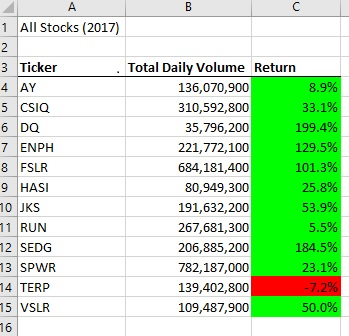
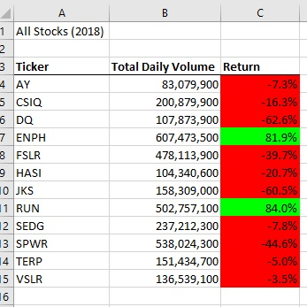

# Stock-Analysis VBA Challege
Performed stock Analysis using Excel Macro with Visual Basic language

# Challenge

## Project Background
The purpose of this stock analysis is to help Steve obtain and compare Total Daily Volume and Yearly Return of each target stock in years of 2017 and 2018. 
By designing a program using VBA Macro, Steve can now observe and make conclusions on which stock performs better than others. 
Using Macro reduces the possibility of human error for repetitive calculator tasks. In addition, Steve can apply Macro in multiple sheets for multiple stocks simultaneously.
Refactoring the project created one outer loop and three nested loops in order to loop through the stock original data only once and collect all information in a single pass.

## Results
In 2017, all of stocks had positive Return except *TERP* (-7.2%). "DQ" made best yearly return with 199.4% but with lowest total Daily Volume (35,796,200) in 2017.

In 2018, only *ENPH* and *RUN* two stocks had positive yearly Return as well as large Total Daily Volume. Both of them out performed the others green stocks.

## Program Code
   'Activate data worksheet
    Worksheets(yearValue).Activate
    
    'Get the number of rows to loop over
    RowCount = Cells(Rows.Count, "A").End(xlUp).Row
    
    '1a) Create a ticker Index
        Dim tickerIndex As Single
        tickerIndex = 0

    '1b) Create three output arrays
        Dim tickerStartingPrices(12) As Single
        Dim tickerEndingPrices(12) As Single
        Dim tickerVolumes(12) As Long
    
    ''2a) Create a for loop to initialize the tickerVolumes to zero.
    ' If the next row’s ticker doesn’t match, increase the tickerIndex.
        For i = 0 To 11
        tickerVolumes(i) = 0
        
        Next i
        
    ''2b) Loop over all the rows in the spreadsheet.
    For i = 2 To RowCount
    
        '3a) Increase volume for current ticker
        If Cells(i, 1).Value = tickers(tickerIndex) Then
            tickerVolumes(tickerIndex) = tickerVolumes(tickerIndex) + Cells(i, 8).Value
        End If
        
        '3b) Check if the current row is the first row with the selected tickerIndex.
        'If  Then
         If Cells(i, 1).Value = tickers(tickerIndex) And Cells(i - 1, 1).Value <> tickers(tickerIndex) Then
            tickerStartingPrices(tickerIndex) = Cells(i, 6).Value
         End If
                                  
        'End If
        
        '3c) check if the current row is the last row with the selected ticker
        'If  Then
         If Cells(i, 1).Value = tickers(tickerIndex) And Cells(i + 1, 1).Value <> tickers(tickerIndex) Then
            tickerEndingPrices(tickerIndex) = Cells(i, 6).Value
            
            '3d Increase the tickerIndex.
            tickerIndex = tickerIndex + 1
         End If
        'End If
    
     Next i
    
    '4) Loop through your arrays to output the Ticker, Total Daily Volume, and Return.
    For i = 0 To 11
        
        Worksheets("All Stocks Analysis").Activate
        tickerIndex = i
        Cells(i + 4, 1).Value = tickers(i)
        Cells(i + 4, 2).Value = tickerVolumes(i)
        Cells(i + 4, 3).Value = tickerEndingPrices(i) / tickerStartingPrices(i) - 1
        
    Next i
    
    'Formatting
    Worksheets("All Stocks Analysis").Activate
    Range("A3:C3").Font.FontStyle = "Bold"
    Range("A3:C3").Borders(xlEdgeBottom).LineStyle = xlContinuous
    Range("B4:B15").NumberFormat = "#,##0"
    Range("C4:C15").NumberFormat = "0.0%"
    Columns("B").AutoFit

    dataRowStart = 4
    dataRowEnd = 15

    For r = dataRowStart To dataRowEnd
        
        If Cells(r, 3) > 0 Then
            
            Cells(r, 3).Interior.Color = vbGreen
            
        Else
        
            Cells(r, 3).Interior.Color = vbRed
            
        End If
        
    Next r
    
 
    endTime = Timer
    MsgBox "This code ran in " & (endTime - startTime) & " seconds for the year " & (yearValue)

End Sub

## Summary
The advantages of refactoring code were that it took less time run all the data and the program was easier to read.
The disadvantages is that it does take more time to write, it produced more bugs, and doing that it took more time to get it correct and run.
The pros about this was it was easy to look at my code and see were I left off at and correct the bugs because alot of them were in the same syntax.
The cons about this was that it was time consumming and you can get frustrated getting the same error or bug code over and over again, then delete the line of code and tpye it back and it runs throught just fine.
